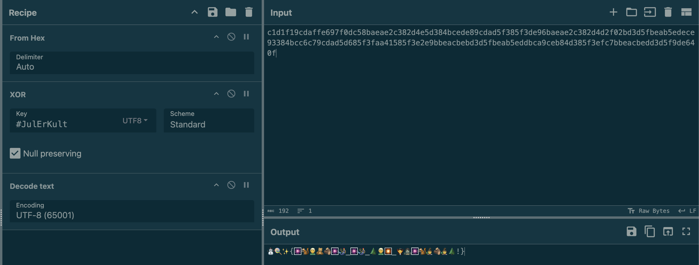

# JuleCTF – Luke 10

**Author:** olefredrik
**Description:**

> Etter suksessen med julespråk prøvde jeg meg på julevev i år. Men noen ser ut til å ha stjålet flagget mitt. Kan du hjelpe meg å få det tilbake?

**Provided:** `inbrudd.pcap`

The PCAP supposedly contains the “break-in” on the Christmas webserver. Our job: figure out what was stolen and recover it.

---

## Step 1 — Dig Into the PCAP

Opening the file in Wireshark, I filtered for HTTP traffic:

```bash
http
```

Sure enough — normal GET and POST traffic. The next step was to reconstruct the files transferred during the session:

```txt
File → Export Objects → HTTP
```

This reveals a small website:

* `/` (saved as `index.html`)
* A couple of font files

It already smelled like a staged exfiltration.

---

## Step 2 — Inspecting the Website

Opening `index.html`, the page renders mostly fine, but one thing stands out:

* The site uses **a custom emoji font**
* The text in the rendered HTML is **visible**
* The text in the HTML file is **not visible**

There’s a comment in the source code:

```html
<!-- /🎊🐿🎇? -> ❄🥧🧛🦊 🍢 🏔🧸🎆🧜🧙 🪵 🧚🧜🧝🎇🥧🦊🧛🧸🧝🧙. 🍾🔔🍪-🧙🍡🦊🦊🎆🦉 🎆🧜 '#⛄🥧🦉🎀🧜🌟🥧🦉🧟' -->
```

Uncommenting it and displaying it on the website reveals the secret:

```html
/cmd? -> Husk å fjern i produksjon. XOR-nøkkel er '#JulErKult'
```

This is one of those moments where the challenge designer politely hands you the key on a plate.

So the exfiltrated data is XOR’d, and the key is:

```txt
#JulErKult
```

Noted.

---

## Step 3 — Finding the Stolen Payload

Inside the PCAP, one GET request stands out.

```http
GET /cmd?cat%20flag.txt HTTP/1.1
Host: jule.web
```

```http 200 OK
HTTP/1.0 200 OK
Server: SimpleHTTP/0.6 Python/3.13.5

..........X............................+........3.............................................d.
```

Given the comment in the HTML, I’m confident:

> This file contains the stolen flag text, XOR’d with the key `#JulErKult`.

The next step is to decrypt it, after saving the response as `raw` data.

> See [flag.raw](flag.raw) for raw flag.

---

## Step 4 — Decrypting the Payload (CyberChef FTW)

CyberChef makes simple XOR decoding effortless.

Recipe used:

1. `From Hex`
2. `XOR`
   * Key: `#JulErKult`
   * Key format: `UTF8`
3. `To UTF-8`

Immediately, the output appears:

```txt
⛄🍭✨{🎆🐿🧝🧸🪵🎆🧜_🎆🧜_🌲🧝🎇_🧛🧟🎆🐿🧙🪵🧙🌲!}
```



This definitely isn’t compressed data or ASCII text — it’s a giant emoji soup.

Which means…
It must be intended for the **custom emoji font** bundled in the website.

---

## Step 5 — Rendering the Emoji With the Website’s Font

The trick behind this challenge is clever:
The emoji string is not meant to be human-readable. Instead, the website’s custom font maps each emoji codepoint to a normal ASCII glyph.

All i have to do is:

* Open the exported website locally
* Paste the decrypted emoji string into the HTML placeholder
* Refresh the page

And magically, the emojis render as the real flag:

```bash
JUL{emojier_er_god_stemning!}
```

The thief’s stolen message becomes clear once again.

---

## Final Flag

```bash
JUL{emojier_er_god_stemning!}
```

---
