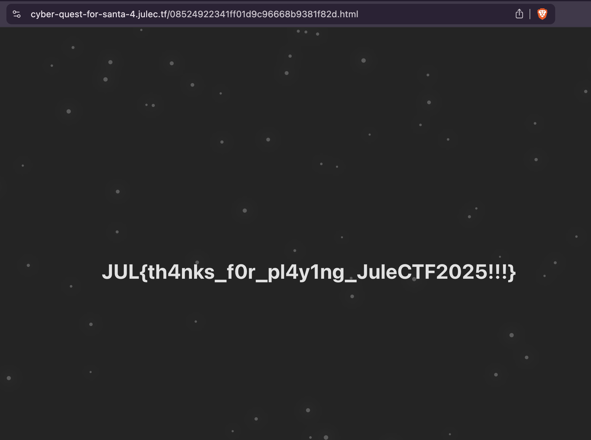

# Cyber Quest for Santa 4, Luke 24

**Description**:
>Cyber, Cyber! Cyberoppdraget for å redde Cyberlandslagsnissen og selve julen nærmer seg slutten!
>
>Etter å ha spist seg mette på melk og julekjeks ser Cyber og Rudolf noe reise seg i horisonten. Langt der fremme glitrer et gigantisk is-slott, bygget av ren kode og frost. De vet begge hva det betyr.
>
>Der finner de Cyberlandslagsnissen!
>
>Uten å nøle setter de av gårde, sammen med reinsdyrene, så raskt beina bærer dem gjennom den digitale snøen. Til slutt når de frem til portene av slottet – og idet de åpnes, møter de noen svært kjente fjes.
>
>Patchlaus Per og Sniffersen...

**Link**: <https://cyber-quest-for-santa-4.julec.tf>

## Overview

After some recon on the website it became clear that the target was the game backend at `wss://cyber-quest-for-santa-4.julec.tf/server`. And the goal: open all three doors and trigger the hidden navigate event to reveal the flag page. I did not manage to do the obvius moving out of bounds or removing collsions.

## Looking around the map

- Downloaded the game bundle locally and inspected the main client script: `cutscene-BB-cV8lx.js`.
- Found WebSocket client logic (`Pl` initializer) showing message types: `pos`, `switch`, `doors`, `navigate`, `switch_reject`.
- Switch locations (from live probing):
  - Switch 1: (312, 1970)
  - Switch 2: (1510, 1970)
  - Switch 3: (1055, 1433)
  - Switch 4: (1051, 939)
- Observed anti-cheat: server expects frequent `pos` updates; moving too fast triggers `teleport` back.

## Ciphered dialogs → Hidden parameter

- `cutscene-BB-cV8lx.js` contains NPC/dialog text as `TextDecoder` byte arrays. They are a simple substitution cipher.
- Decoding key snippets (see `cutscene-BB-cV8lx.js`):
  - "It seems that they changed the 'isAuthorized' flag from false to true?!"
  - "How did they manage to guess that you need to set both 'isAuthorized' and 'superSecretBooleanFlag' to true for the switch to work?!"
- Takeaway: Switch 4 requires **both** `isAuthorized: true` and `superSecretBooleanFlag: true`.
Plaintext is shown when talking to the characters in the browser.

## Exploitation script

- Wrote `test.py` to automate movement and switch toggles using `websockets`.
- Key logic:
  - Send continuous `pos` messages from spawn `(972, 2671)` toward each switch.
  - For switches 1–3: send `{"type":"switch","id":N,"isAuthorized":true}`.
  - For switch 4: send `{"type":"switch","id":4,"isAuthorized":true,"superSecretBooleanFlag":true}`.
  - After doors open, sweep the upper map rows to hit the final trigger.

## Finding the flag

- Upon sweeping after unlocking door3, the server sent:
  - `{"type":"navigate","path":"/08524922341ff01d9c96668b9381f82d.html"}`
- Fetching that path returned the flag page.



## Flag

```txt
JUL{th4nks_f0r_pl4y1ng_JuleCTF2025!!!}
```

## References

- Code/data inspected: `cutscene-BB-cV8lx.js`
- Exploit script: `test.py`
- Remote endpoints: `wss://cyber-quest-for-santa-4.julec.tf/server`, `https://cyber-quest-for-santa-4.julec.tf/08524922341ff01d9c96668b9381f82d.html`
