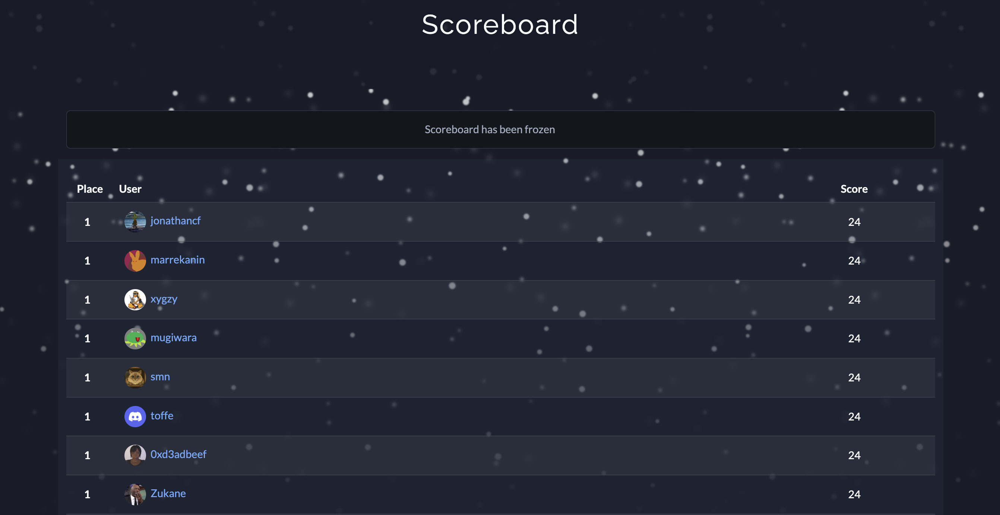

# JuleCTF 2025

Cyberlandslagsnissen trenger din hjelp! Hver dag i desember fram mot jul kommer det nye utfordringer innen cybersikkerhet.
For mer informasjon om konkurransen se /info.

## About

Dette er en samling CTF-oppgaver og tilhørende writeups fra JuleCTF 2025 fra [Cyberlandslaget](https://cyberlandslaget.no/)

## Challanges

Here is each slot:

1. [Luke_1](Luke_1/) — solved
2. [Luke_2](Luke_2/) — solved
3. [Luke_3](Luke_3/) — solved
4. [Luke_4](Luke_4/) — solved
5. [Luke_5](Luke_5/) — solved
6. [Luke_6](Luke_6/) — solved
7. [Luke_7](Luke_7/) — solved
8. [Luke_8](Luke_8/) — solved
9. [Luke_9](Luke_9/) — solved
10. [Luke_10](Luke_10/) — solved
11. [Luke_11](Luke_11/) — solved
12. [Luke_12](Luke_12/) — solved
13. [Luke_13](Luke_13/) — solved
14. [Luke_14](Luke_14/) — solved
15. [Luke_15](Luke_15/) — solved
16. [Luke_16](Luke_16/) — solved
17. [Luke_17](Luke_17/) — solved
18. [Luke_18](Luke_18/) — solved
19. [Luke_19](Luke_19/) — solved
20. [Luke_20](Luke_20/) — solved
21. [Luke_21](Luke_21/) — solved
22. [Luke_22](Luke_22/) — solved
23. [Luke_23](Luke_23/) — solved
24. [Luke_24](Luke_24/) — solved

[Bonus]

1. [Luke_6](Luke_6/) — not solved
2. [Luke_13](Luke_13/) — solved
3. [Luke_20](Luke_20/) — not solved

### Scoreboard

